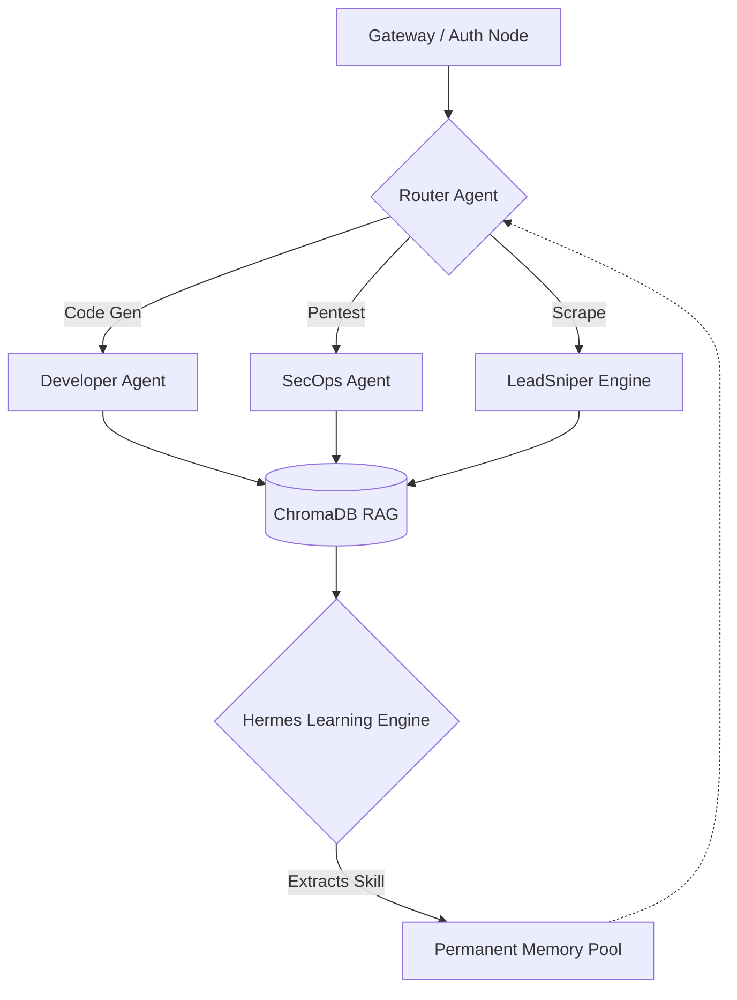

# M4STCLAW v5 Architecture

## System Topology
M4STCLAW v5 operates as a decentralized, multi-agent Directed Acyclic Graph (DAG). By completely removing linear, human-in-the-loop dependencies, the architecture functions as a self-healing mesh.

## Core Components

### 1. The Hermes Learning Engine
Instead of writing new scripts for every task, M4STCLAW utilizes Hermes—a recursive meta-learning loop. When an agent successfully completes a complex task (e.g., bypassing a specific WAF during a pentest), Hermes analyzes the execution trace, extracts the sequence, and compiles it into a reusable MCP (Model Context Protocol) tool. 

### 2. Zero-Cost Infrastructure via API Balancing
To replicate enterprise-grade stability without the $10,000/mo cloud bills:
- The system maintains a dynamic pool of 56 free-tier API keys.
- Requests are load-balanced and rate-limited at the token level.
- Upon hitting a `429 Too Many Requests`, the routing layer seamlessly fails over to the next key without halting the DAG execution.

### 3. LeadSniper Intent Engine
A specialized subnet dedicated to high-frequency B2B intelligence.
- Listens to global webhooks and public event streams (e.g., GitHub PushEvents).
- Correlates isolated data points to extract highly guarded private endpoints (e.g., hidden comms emails).
- Passes raw leads through an LLM constraint-pipeline to filter out low-intent targets before initiating outreach.

### Security Posture
- All inter-node communication is strictly typed and validated against pre-defined schema constraints to prevent prompt injection or hallucination-based drift.
- WAF Evasion techniques are built into the core crawler primitives, utilizing rotating residential proxy pools and TLS fingerprint obfuscation.
