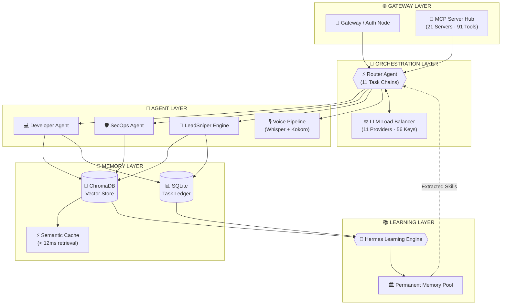
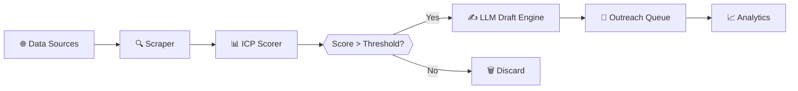

<![CDATA[# 🏗️ MAST Ecosystem — System Architecture

> **M4STCLAW v5 + OpenWork + EIGENT** — Unified Autonomous Agent Infrastructure

---

## High-Level System Topology

MAST operates as a **decentralized, multi-agent Directed Acyclic Graph (DAG)**. By completely removing linear, human-in-the-loop dependencies, the architecture functions as a self-healing mesh with automatic failover, semantic memory retrieval, and zero-cost execution.


```mermaid
graph TB
    subgraph "🌐 GATEWAY LAYER"
        GW["🔐 Gateway / Auth Node"]
        MCP["📡 MCP Server Hub<br/>(21 Servers · 91 Tools)"]
    end

    subgraph "🧠 ORCHESTRATION LAYER"
        R{{"⚡ Router Agent<br/>(11 Task Chains)"}}
        LB["⚖️ LLM Load Balancer<br/>(11 Providers · 56 Keys)"]
    end

    subgraph "🤖 AGENT LAYER"
        DEV["💻 Developer Agent"]
        SEC["🛡️ SecOps Agent"]
        LEAD["🎯 LeadSniper Engine"]
        VOICE["🎙️ Voice Pipeline<br/>(Whisper + Kokoro)"]
    end

    subgraph "💾 MEMORY LAYER"
        CHROMA[("🧬 ChromaDB<br/>Vector Store")]
        SQL[("📊 SQLite<br/>Task Ledger")]
        CACHE["⚡ Semantic Cache<br/>(< 12ms retrieval)"]
    end

    subgraph "📚 LEARNING LAYER"
        HERMES{{"🔮 Hermes Learning Engine"}}
        PERM["🏛️ Permanent Memory Pool"]
    end

    GW --> R
    MCP --> R
    R --> DEV
    R --> SEC
    R --> LEAD
    R --> VOICE
    R <--> LB

    DEV --> CHROMA
    SEC --> CHROMA
    LEAD --> CHROMA
    DEV --> SQL
    LEAD --> SQL

    CHROMA --> CACHE
    CHROMA --> HERMES
    SQL --> HERMES
    HERMES --> PERM
    PERM -.->|"Extracted Skills"| R
```

---

## Component Deep-Dive

### 1. 🔐 Gateway & MCP Server Hub

| Component | Details |
|-----------|---------|
| **MCP Servers** | 21 custom-built Model Context Protocol servers |
| **Tools Registered** | 91 tools across all servers |
| **IDE Support** | Cursor, VSCode, Windsurf, OpenCode, Antigravity |
| **Auth** | Token-based with automatic refresh |

The gateway validates incoming requests, manages session state, and routes them to the appropriate MCP server. Each MCP server exposes a specialized tool interface — from code generation to OSINT scanning.

### 2. ⚡ Router Agent & LLM Load Balancer

The Router is the brain of the system. It classifies incoming tasks into one of **11 predefined task chains** and dispatches them to the appropriate specialist agent.

**LLM Provider Matrix:**

| Provider | Model | Use Case | Fallback Priority |
|----------|-------|----------|-------------------|
| Groq | LLaMA 3.1 70B | High-speed reasoning | 1 |
| Cerebras | LLaMA 3.1 70B | Groq overflow | 2 |
| Kimi | K2 | Deep code generation | 3 |
| Together AI | Qwen3-Coder | Code completion | 4 |
| OpenRouter | Mixed routing | Multi-model queries | 5 |
| Ollama (Local) | Qwen3 / Deepseek | Offline fallback | Last resort |

**Routing Logic:**
```
REQUEST → Classify Intent → Select Chain → Pick Provider (by latency + quota)
    ↓ (if 429)
    Failover → Next Provider → Retry with exponential backoff
    ↓ (if all providers exhausted)
    Local LLM via Ollama → Complete task offline
```

### 3. 🔮 Hermes Learning Engine

Instead of writing new scripts for every task, MAST utilizes **Hermes** — a recursive meta-learning loop:

1. **Observe**: Monitor agent execution traces in real-time
2. **Extract**: When a complex task succeeds, extract the action sequence
3. **Compile**: Convert the sequence into a reusable MCP tool
4. **Register**: Add the tool to the permanent memory pool
5. **Route**: Future similar tasks are auto-routed to the compiled tool

This creates a **self-improving system** — the more tasks MAST completes, the more efficient it becomes.

### 4. 💾 3-Tier Memory Architecture

```
┌─────────────────────────────────────────────┐
│  Tier 1: Semantic Cache (ChromaDB)          │
│  → Embedding-based similarity matching      │
│  → Sub-12ms retrieval at 0.98 threshold     │
│  → Reduces redundant LLM calls by 40-60%   │
├─────────────────────────────────────────────┤
│  Tier 2: Task Ledger (SQLite)               │
│  → Structured task logs and execution state  │
│  → Agent conversation history               │
│  → Audit trail for security compliance      │
├─────────────────────────────────────────────┤
│  Tier 3: Permanent Memory Pool              │
│  → Extracted skills from Hermes engine       │
│  → Long-term knowledge base                 │
│  → Cross-session context retrieval          │
└─────────────────────────────────────────────┘
```

### 5. 🎯 LeadSniper Intent Engine

A specialized sub-system for **autonomous B2B intelligence and outreach:**


```mermaid
graph LR
    A["🌐 Data Sources"] --> B["🔍 Scraper"]
    B --> C["📊 ICP Scorer"]
    C --> D{{"Score > Threshold?"}}
    D -->|Yes| E["✍️ LLM Draft Engine"]
    D -->|No| F["🗑️ Discard"]
    E --> G["📧 Outreach Queue"]
    G --> H["📈 Analytics"]
```

- Scrapes targets from open directories and public event streams
- Scores leads against custom ICP (Ideal Customer Profile) criteria
- Generates hyper-personalized outreach via LLM pipeline
- Tracks engagement and auto-adjusts scoring weights

### 6. 🛡️ Security Posture

| Layer | Implementation |
|-------|---------------|
| **Inter-Node Comms** | Strictly typed, schema-validated JSON-RPC |
| **Prompt Injection Defense** | Input sanitization + output validation |
| **Authorized Targets** | Hardcoded `authorized_targets.txt` check before any scan |
| **Key Management** | 56-key rotation pool with automatic failover |
| **Audit Trail** | Every action logged to SQLite with timestamp and agent ID |

---

## Hardware Requirements

```
┌─────────────────────────────────────────────┐
│  MINIMUM VIABLE SETUP                       │
│                                             │
│  GPU: NVIDIA RTX 2060 Super (8GB VRAM)      │
│  RAM: 16GB DDR4                             │
│  Storage: 256GB SSD                         │
│  OS: Linux (Ubuntu 22.04+) or Windows 11    │
│  Runtime: Python 3.10+ · Node.js 18+        │
│  Cost: ₹0/month (all free-tier APIs)        │
└─────────────────────────────────────────────┘
```

---

## Roadmap

- [ ] MAST v1.1 — Persistent agent state across sessions
- [ ] Multi-GPU support for local inference
- [ ] Browser-based MAST dashboard (real-time monitoring)
- [ ] Plugin marketplace for community MCP servers
- [ ] Mobile notification integration via Telegram bot

---

<div align="center">

**Built by [M4ST](https://github.com/m4stanuj) · Powered by consumer hardware · Operational cost: ₹0/month**

</div>
]]>
