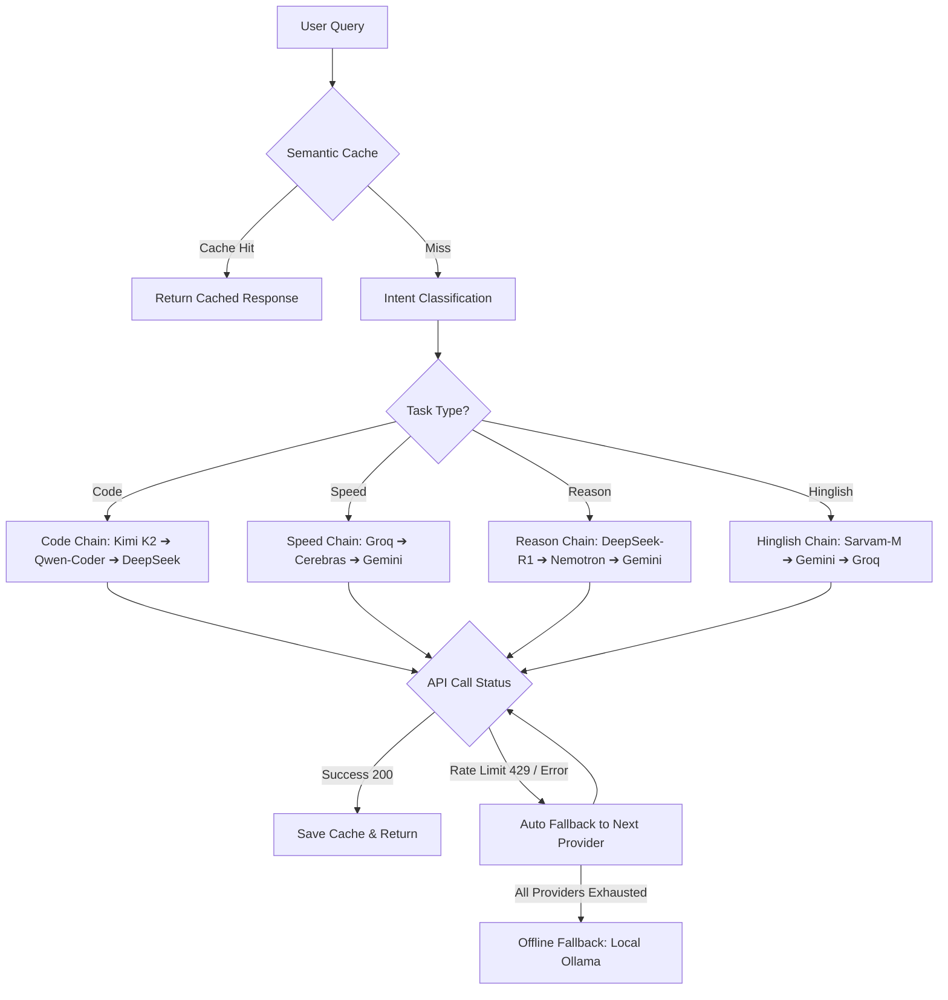
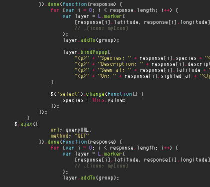
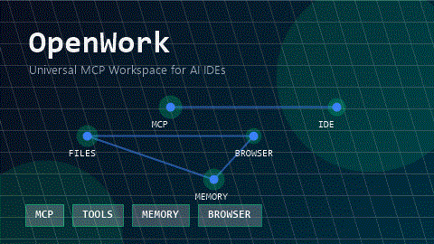
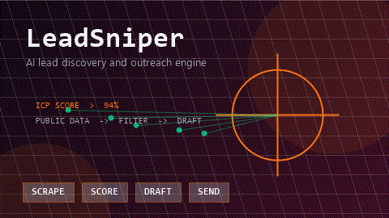

# m4stanuj

<p align="center"><a href="https://github.com/m4stanuj"></a></p>

<p align="center"><a href="https://git.io/typing-svg"></a></p>

```
┌────────────────────────────────────────────────────────────────────────┐
│  [ SYSTEM ONLINE ] -> MAST v1.0 Active.                                │
│  "Building self-healing multi-agent DAG networks on consumer hardware"  │
│  Hardware: NVIDIA RTX 2060 Super (8GB VRAM) · Operational Cost: ₹0/mo  │
└────────────────────────────────────────────────────────────────────────┘
```

<p align="center"><a href="https://linkedin.com/in/m4stanuj"></a> <a href="https://m4stanuj.github.io"></a> <a href="mailto:m4stanuj@gmail.com"></a> <a href="https://fiverr.com/m4stanuj"></a> <a href="https://github.com/m4stanuj"></a></p>

---

## 🧠 Fallback Routing & Execution Algorithm

The MAST Ecosystem is orchestrated as a decentralized, multi-agent Directed Acyclic Graph (DAG). Requests are evaluated via a semantic caching layer, categorized, and dynamically routed across 11 LLM API providers on free-tier rotations, with automatic fallback to local offline models.



---

## ⚡ Pinned Projects Showcase

<table width="100%">
  <tr>
    <td width="50%" valign="top">
      <h3 align="center">🏗️ MAST v1.0 — Unified AI Operator</h3>
      <p align="center">
        
      </p>
      <p>M4STCLAW + OpenWork + EIGENT merged into one autonomous stack. Features 21 MCP servers, 11 LLM providers, 11 task chains, and a 3-tier ChromaDB memory engine. Runs entirely locally on consumer VRAM (RTX 2060 Super) at ₹0/month.</p>
      <p align="center">
        <code>LangGraph</code> <code>ChromaDB</code> <code>Ollama</code> <code>MCP</code> <code>Local LLM</code>
      </p>
    </td>
    <td width="50%" valign="top">
      <h3 align="center">🛡️ cai-osint — OSINT & Pentest Framework</h3>
      <p align="center">
        
      </p>
      <p>AI-orchestrated autonomous recon framework integrating Shodan, Nmap, and Nuclei. Implements CEH-aligned methodologies with strict, hardcoded target checks to scan only authorized scopes.</p>
      <p align="center">
        <code>OSINT</code> <code>Nmap API</code> <code>Shodan</code> <code>Nuclei</code> <code>Security</code>
      </p>
    </td>
  </tr>
  <tr>
    <td width="50%" valign="top">
      <h3 align="center">🔌 OpenWork — Universal MCP Workspace</h3>
      <p align="center">
        
      </p>
      <p>16 system-level Model Context Protocol (MCP) servers that plug seamlessly into any AI IDE like Cursor, VSCode, Windsurf, or OpenCode. Connects custom tools to your workspace via one JSON config.</p>
      <p align="center">
        <code>MCP Server</code> <code>IDE Integration</code> <code>JSON Config</code> <code>Playwright</code>
      </p>
    </td>
    <td width="50%" valign="top">
      <h3 align="center">🎯 LeadSniper — AI Outreach Engine</h3>
      <p align="center">
        
      </p>
      <p>Autonomous lead generation and outreach pipeline. Scrapes public directories, filters and scores prospects against custom ICP (Ideal Customer Profiles) rules, and drafts personalized email copy.</p>
      <p align="center">
        <code>Web Scraping</code> <code>LLM Routing</code> <code>Outreach</code> <code>Python</code>
      </p>
    </td>
  </tr>
</table>

---

## 📊 System Diagnostics

<p align="center">
  
  
</p>

<p align="center">
  
</p>

---

## 🛠️ Integrated Stack Components

### Core Languages & Frameworks
<p align="left">
  <a href="https://skillicons.dev">
    
  </a>
</p>

### AI / ML / Orchestration


### Infrastructure & Tools
<p align="left">
  <a href="https://skillicons.dev">
    
  </a>
</p>

### Security & OSINT


---

## 🐍 Contribution Graph

<p align="center">
  <picture>
    <source media="(prefers-color-scheme: dark)" srcset="https://raw.githubusercontent.com/m4stanuj/m4stanuj/output/github-contribution-grid-snake-dark.svg" />
    <source media="(prefers-color-scheme: light)" srcset="https://raw.githubusercontent.com/m4stanuj/m4stanuj/output/github-contribution-grid-snake.svg" />
    
  </picture>
</p>

---

## 🏆 System Highlights

<p align="center">
  <a href="https://github.com/ryo-ma/github-profile-trophy">
    
  </a>
</p>

> **[ 🏗️ MAST ECOSYSTEM ARCHITECT ]**
> Built a unified autonomous agent system merging 3 major frameworks (M4STCLAW, OpenWork, EIGENT) into one installable stack. 21 MCP servers, 11 LLM providers, consumer hardware only.

> **[ 🛡️ OSINT & PENTEST AUTOMATION ]**
> Engineered an AI-orchestrated recon framework integrating Shodan, Nmap, and Nuclei. CEH-aligned workflow with hardcoded authorized-target verification before any scan.

> **[ ⚡ ZERO-COST INFRASTRUCTURE ]**
> Designed a free-tier LLM routing system across 11 providers with automatic fallback, semantic response caching (40-60% API cost reduction), and local model fallback — operational cost: ₹0/month.

> **[ 🎯 SOLO OPERATOR SCALE ]**
> Built LeadSniper to handle full B2B outreach autonomously — scraping, ICP scoring, and personalized drafting — all running locally on an RTX 2060 Super without any cloud dependency.

---

## 🛰️ `> execute contact_protocol.sh`

```
┌─────────────────────────────────────────────────────────────┐
│                                                             │
│   OPEN TO: Freelance AI Automation · AI Engineering Roles   │
│            Open Source Collaborations · MCP Contracts        │
│                                                             │
│   RESPONSE TIME: < 12 hours                                 │
│   PREFERRED: Direct message or email                        │
│                                                             │
└─────────────────────────────────────────────────────────────┘
```

<p align="center">
  <a href="https://m4stanuj.github.io">
    
  </a>
  <a href="mailto:m4stanuj@gmail.com">
    
  </a>
  <a href="https://linkedin.com/in/m4stanuj">
    
  </a>
</p>


