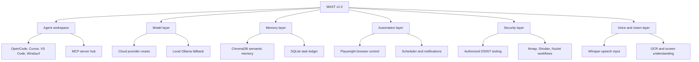
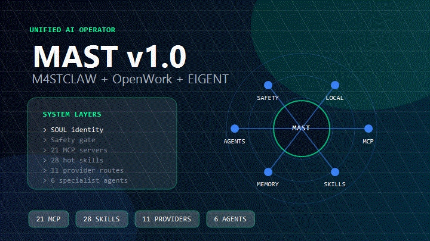
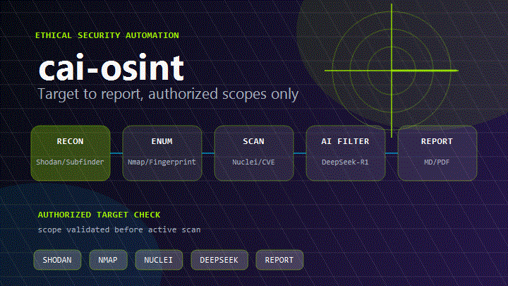
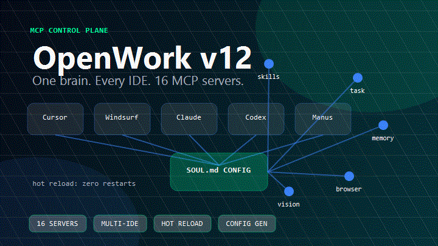
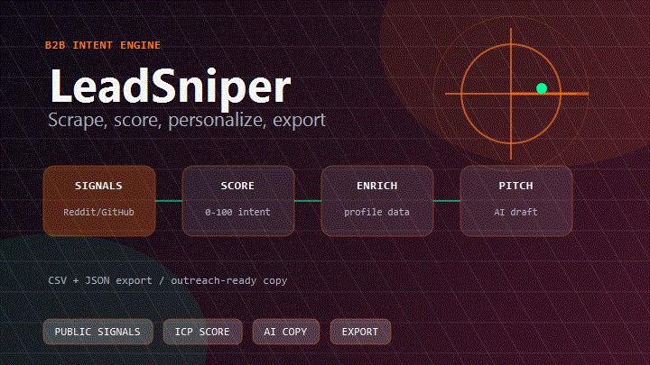

# M4ST / Anuj

<p align="center">
  <a href="https://github.com/m4stanuj">
    
  </a>
</p>

<p align="center">
  <a href="https://git.io/typing-svg">
    
  </a>
</p>

<p align="center">
  <a href="https://in.linkedin.com/in/mast-anuj"></a>
  <a href="https://x.com/m4stanuj"></a>
  <a href="mailto:mast.jarvis@gmail.com"></a>
  <a href="https://fiverr.com/m4stanuj"></a>
  <a href="https://m4st.vercel.app"></a>
</p>

<p align="center">
  
  
  
  
</p>

---

## Signal

I build practical AI systems that survive real constraints: limited VRAM, free-tier APIs, Windows/Kali workflows, messy browser automation, and tools that need to keep working after the demo.

## Current Focus

- Shipping the **M4ST** ecosystem as local-first AI operator infrastructure.
- Improving repo trust surfaces: security policies, contribution docs, safer demos, and reproducible setup.
- Building daily, useful GitHub streaks through real docs, tests, examples, CI, and demo upgrades.
- Keeping security/OSINT work authorized-only, defensive, and scope-gated.

Public build notes: [DEVLOG.md](DEVLOG.md) · [CONTRIBUTION_SPRINT.md](CONTRIBUTION_SPRINT.md)

<table>
  <tr>
    <td width="33%"><b>Agent Infrastructure</b><br/>MCP servers, memory layers, tool routers, schedulers, fallback chains, and workspace automation.</td>
    <td width="33%"><b>Local AI Systems</b><br/>Ollama, Qwen-style local models, ChromaDB cache, voice/vision utilities, and offline fallback design.</td>
    <td width="33%"><b>Security Automation</b><br/>Authorized OSINT, recon pipelines, Nmap/Shodan/Nuclei workflows, browser testing, and CEH-aligned methodology.</td>
  </tr>
</table>

<table>
  <tr>
    <td width="60%" valign="top">
      <h3>MAST v1.0: Mast Autonomous System Terminal</h3>
      <p><b>MAST</b> is my main build: a local-first AI operator that connects LLM routing, MCP tools, memory, browser automation, voice/vision utilities, and defensive security workflows into one workspace.</p>
      <p>It is designed for consumer hardware, unstable free-tier APIs, and real daily work where the assistant needs context, tools, and recovery paths instead of just chat.</p>
    </td>
    <td width="40%" valign="top">
      <h3>Core Numbers</h3>
      <p>
        
        
        
        
      </p>
      <p><b>Hardware target:</b> RTX 2060 Super, 8GB VRAM, local fallback ready.</p>
    </td>
  </tr>
</table>

---

## MAST Ecosystem Map



---

## Flagship Builds

<table width="100%">
  <tr>
    <td width="50%" valign="top">
      <h3 align="center"><a href="https://github.com/m4stanuj/MAST">MAST v1.0 - Autonomous System Terminal</a></h3>
      <p align="center"><a href="https://github.com/m4stanuj/MAST"></a></p>
      <p>Unified AI stack merging M4STCLAW, OpenWork, and EIGENT into a local-first operator: 21 MCP servers, 11 provider routes, task chains, semantic cache, memory, scheduler, and local fallback.</p>
      <p align="center"><code>MCP</code> <code>LangGraph</code> <code>ChromaDB</code> <code>Ollama</code> <code>Python</code></p>
      <p align="center"><a href="https://github.com/m4stanuj/MAST">Repository</a> | <a href="https://github.com/m4stanuj/MAST/releases">Releases</a></p>
    </td>
    <td width="50%" valign="top">
      <h3 align="center"><a href="https://github.com/m4stanuj/cai-osint">cai-osint - Authorized Recon Framework</a></h3>
      <p align="center"><a href="https://github.com/m4stanuj/cai-osint"></a></p>
      <p>AI-assisted OSINT and pentest workflow with Nmap, Shodan, Nuclei, target-scope guardrails, and CEH-style methodology for defensive research and authorized testing.</p>
      <p align="center"><code>OSINT</code> <code>Nmap</code> <code>Shodan</code> <code>Nuclei</code> <code>Security</code></p>
      <p align="center"><a href="https://github.com/m4stanuj/cai-osint">Repository</a> | <a href="https://github.com/m4stanuj/cai-osint#readme">Methodology</a></p>
    </td>
  </tr>
  <tr>
    <td width="50%" valign="top">
      <h3 align="center"><a href="https://github.com/m4stanuj/openwork">OpenWork - Universal MCP Workspace</a></h3>
      <p align="center"><a href="https://github.com/m4stanuj/openwork"></a></p>
      <p>Portable MCP workspace stack for AI IDEs. Focused on safe file work, browser automation, research, memory, skills, notifications, and tool reconstruction through config.</p>
      <p align="center"><code>MCP Server</code> <code>Playwright</code> <code>JSON-RPC</code> <code>Automation</code></p>
      <p align="center"><a href="https://github.com/m4stanuj/openwork">Repository</a> | <a href="https://github.com/m4stanuj/openwork/releases">Releases</a></p>
    </td>
    <td width="50%" valign="top">
      <h3 align="center"><a href="https://github.com/m4stanuj/LeadSniper">LeadSniper - AI Outreach Engine</a></h3>
      <p align="center"><a href="https://github.com/m4stanuj/LeadSniper"></a></p>
      <p>Local outreach pipeline for scraping public directories, filtering prospects, scoring by ICP rules, and drafting personalized emails through LLM-assisted workflows.</p>
      <p align="center"><code>Scraping</code> <code>LLM Routing</code> <code>ICP Scoring</code> <code>Python</code></p>
      <p align="center"><a href="https://github.com/m4stanuj/LeadSniper">Repository</a> | <a href="https://github.com/m4stanuj/LeadSniper#readme">Pipeline</a></p>
    </td>
  </tr>
</table>

<p align="center">
  <a href="https://github.com/m4stanuj/MAST"></a>
  <a href="https://github.com/m4stanuj/mast-llm-router"></a>
</p>

---

## Integrated Stack Components

<table>
  <tr>
    <td width="50%" valign="top">
      <h3>Core Languages & Frameworks</h3>
      <p>
        
        
        
        
        
        
        
        
      </p>
      <p><b>Also comfortable with:</b> REST APIs, JSON-RPC, CLI tooling, Windows automation, Linux workflows, config-driven systems, and repo packaging.</p>
    </td>
    <td width="50%" valign="top">
      <h3>AI / ML / Orchestration</h3>
      <p>
        
        
        
        
        
        
        
        
      </p>
      <p><b>Model routes:</b> Groq, Cerebras, Gemini, DeepSeek, Kimi K2, Qwen/Qwen-Coder, Together AI, Sarvam-M, Nemotron, and local Ollama fallback.</p>
    </td>
  </tr>
  <tr>
    <td width="50%" valign="top">
      <h3>Infrastructure & Tools</h3>
      <p>
        
        
        
        
        
        
        
        
      </p>
      <p><b>Workspace:</b> Windows AtlasOS, Kali Linux dual boot, OpenCode, Cursor, VS Code, Windsurf, browser automation, and reproducible setup scripts.</p>
    </td>
    <td width="50%" valign="top">
      <h3>Security & OSINT</h3>
      <p>
        
        
        
        
        
        
        
      </p>
      <p><b>Focus areas:</b> authorized recon, target-scope validation, browser fingerprint testing, web automation, vulnerability template workflows, and defensive research tooling.</p>
    </td>
  </tr>
</table>

### Extra Capabilities

<p>
  
  
  
  
  
  
  
  
</p>

---

## GitHub Activity

<p align="center">
  
  
</p>

<p align="center">
  <picture>
    <source media="(prefers-color-scheme: dark)" srcset="https://raw.githubusercontent.com/m4stanuj/m4stanuj/output/github-contribution-grid-snake-dark.svg" />
    <source media="(prefers-color-scheme: light)" srcset="https://raw.githubusercontent.com/m4stanuj/m4stanuj/output/github-contribution-grid-snake.svg" />
    
  </picture>
</p>

---

## Contact Protocol

```text
Open to: AI automation work, MCP integrations, OSINT tooling, agent workflows, and serious open-source collaboration.
Best fit: practical systems that need to run locally, cheaply, and reliably.
Preferred contact: email or LinkedIn DM.
```

<p align="center">
  <a href="mailto:mast.jarvis@gmail.com"></a>
  <a href="https://in.linkedin.com/in/mast-anuj"></a>
  <a href="https://m4st.vercel.app"></a>
</p>


